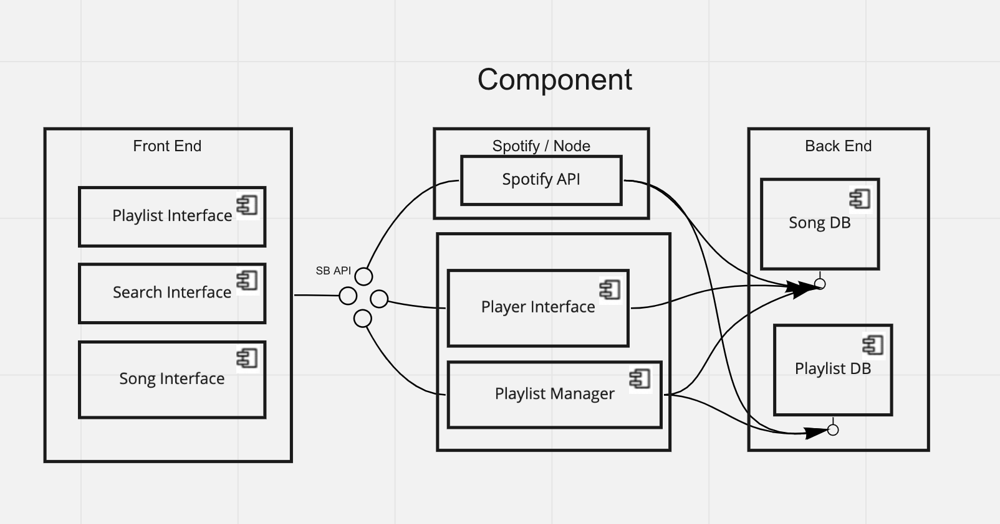
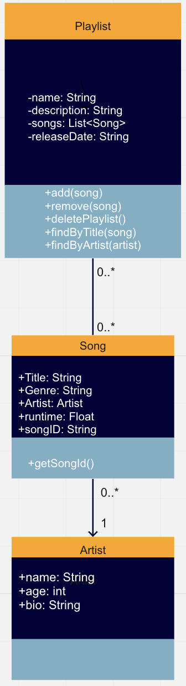

<h1 align="center">Songbank Project</h1>

Description: Our Songbank project is a music service that provides users with a straightforward yet fulfilling experience. Whether one wants to make a playlist with their favorite songs, or choose from a wide array of songs from all over the world, Songbank allows for all of it. Additionally, if more information on a song or artist is desired, our project has links to the corresponding webpage on Spotify, permitting seemless usage between platforms and giving a user the freedom to explore music to the fullest. Follow this guide for installation tips, a look into the process of making Songbank, or 

<ins>Note:</ins> This project was created using [React](https://create-react-app.dev/docs/getting-started/) and [Node](https://nodejs.org/en/docs/guides/getting-started-guide/).

  

<h3 align="center">Initial Prototype and Setup</h3>

Click [here](https://www.figma.com/file/gANEf0D6kaiE56LzjMf83T/Music-Bank?node-id=0%3A1) to see our initial design for Songbank. This design gave us a good idea of what we wanted our project to look like once completed. This made the decision process much easier along the way when choosing between different asthetics and visuals.

  

<h3 align="center">How to Setup/Use Songbank</h3>

1. Clone Songbank repository [here](https://github.com/heberman/csc307SongBank.git)

2. Install device-specific [Node](https://nodejs.org/en/download/) Version
  
3. npm install

4. npm install _____:
   * axios
   * cors
   * react-router-dom
   * express

5. Run bankend with the ***node songbank-backend/backend.js*** command

6. Run frontend with the ***npm start***

7. Website should launch in your default browser

  

<h3 align="center">Diagrams</h3>

Component UML Diagram: 

Class UML Diagram:

Similar to our initial design for Songbank, these diagrams proved to be a great stepping stone in creating a good foundation to start the project. Although these 
UML diagrams are not totally acurate when compared to the final version of Songbank, they are still helpful when trying to visualize the architecture behind it.

  

<h3 align="center">Code Coverage</h3>

Add Code Coverage Results once tests for our website are made.

  

[GO TO TOP](#songbank-project)  
