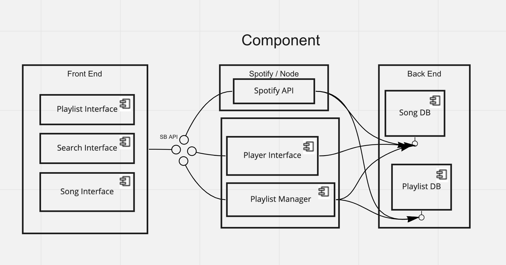
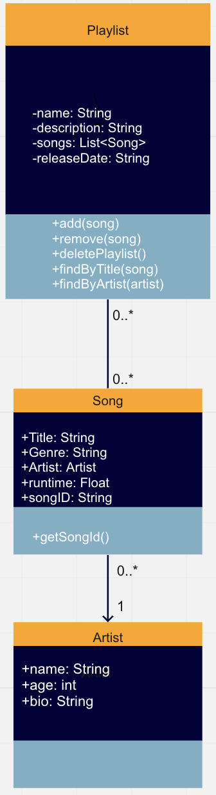
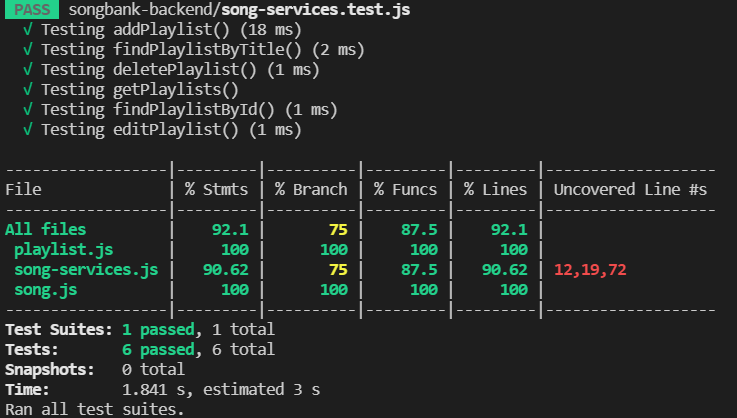

<h1 align="center">Songbank Project</h1>


<p align="center"></p>

Description: Our Songbank project is a music service that provides users with a straightforward yet fulfilling experience. Whether one wants to make a playlist with their favorite songs, or choose from a wide array of songs from all over the world, Songbank allows for all of it. Additionally, if more information on a song or artist is desired, our project has links to the corresponding webpage on Spotify, permitting seemless usage between platforms and giving a user the freedom to explore music to the fullest. Follow this guide for installation tips, a look into the process of making Songbank, or 

<ins>Note:</ins> This project was created using [React](https://create-react-app.dev/docs/getting-started/) and [Node](https://nodejs.org/en/docs/guides/getting-started-guide/).


<br/><br/>


<h3 align="center">Initial Prototype and Setup</h3>

Click [here](https://www.figma.com/file/gANEf0D6kaiE56LzjMf83T/Music-Bank?node-id=0%3A1) to see our initial design for Songbank. This design gave us a good idea of what we wanted our project to look like once completed. This made the decision process much easier along the way when choosing between different asthetics and visuals.


<br/><br/>


<h3 align="center">How to Setup/Use Songbank</h3>

1. Clone Songbank [repository](https://github.com/heberman/csc307SongBank.git)

2. Install device-specific [Node](https://nodejs.org/en/download/) Version

3. Go to the spotify developer dashboard, login, and create a new [application](https://developer.spotify.com/dashboard/).

4. Create a .env file (in the root folder of the project) and include the variables listed below:

```
MONGO_USER=bcdasilv
MONGO_PWD=bcdasilv
MONGO_DB=songbank

SPOTIFY_CLIENT_ID='YOUR_CLIENT_ID'
SPOTIFY_CLIENT_SECRET='YOUR_CLIENT_SECRET'
```
  
5. Run ```npm install```

6. Run bankend with the ```node songbank-backend/backend.js --prod``` command. The ```--prod``` flag stores playlist in the MONGODB Cloud. If you want to store
playlists locally, remove the prod flag.

7. Run frontend with the ```npm start```

8. Website should launch in your default browser


<br/><br/>


<h3 align="center">Diagrams</h3>

Component UML Diagram: <p align="center"></p>

Class UML Diagram:<p align="center"></p>

Similar to our initial design for Songbank, these diagrams proved to be a great stepping stone in creating a good foundation to start the project. Although these 
UML diagrams are not totally acurate when compared to the final version of Songbank, they are still helpful when trying to visualize the architecture behind it.

<br/><br/>


<h3 align="center">Code Coverage</h3>

<p align="center"></p>

<br/><br/>


<h3 align="center">Code Formatter</h3>

For our Songbank project, we decided to use the code formatter Prettier. Prettier is a way to help a project keep a consistent "style" to their code. This allows
for all collaborators to understand and edit files easily without the confusion of multiple different coding styles and formats. To install Prettier for this 
project, run:

```npm install prettier --save-dev```

*NOTE*: Not all files have to be run through prettier for style checking. Create a ```.prettierignore``` to convey which parts of a project you want to be ignored
and add these few lines:

```
# Ignore artifacts:
build
coverage
```

To run all files through prettier, use: ```npx prettier --write .```

Further instructions for installation can be found [here](https://prettier.io/docs/en/install.html), along with additional style 
rules [here](https://prettier.io/docs/en/options.html)

Although Prettier is not required, Prettier was used throughout our project to ensure clarity and simplicity in our code. Additionally, using prettier alongside
the code editor VSCode was extremely easy to use and very efficient. To find how to use Prettier with any editor, visit:
https://prettier.io/docs/en/editors.html

<br></br>

[GO TO TOP](#songbank-project)  
